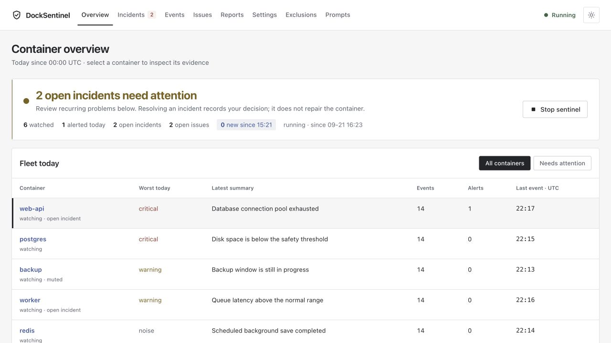
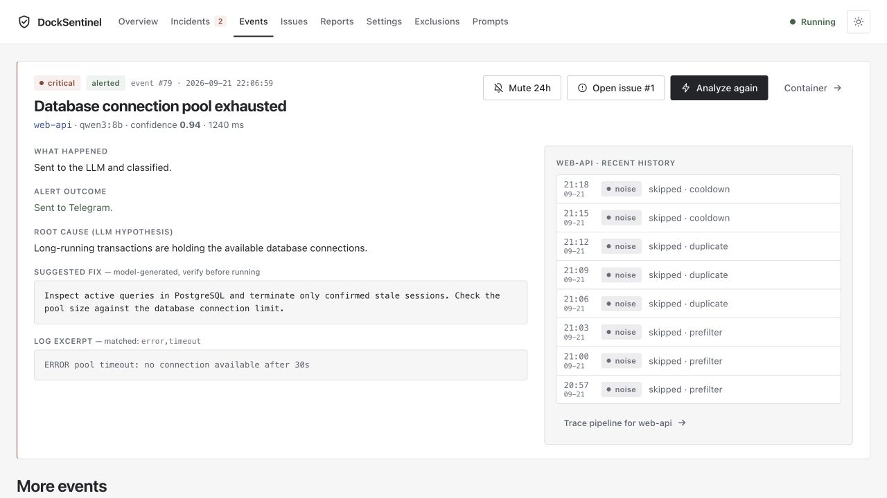
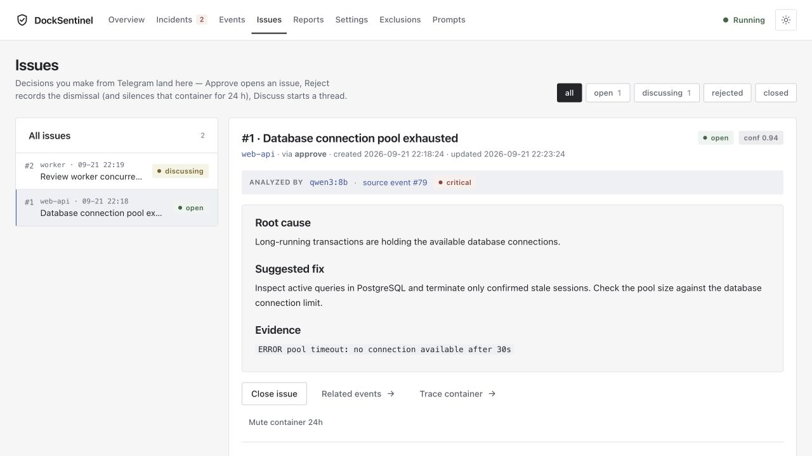
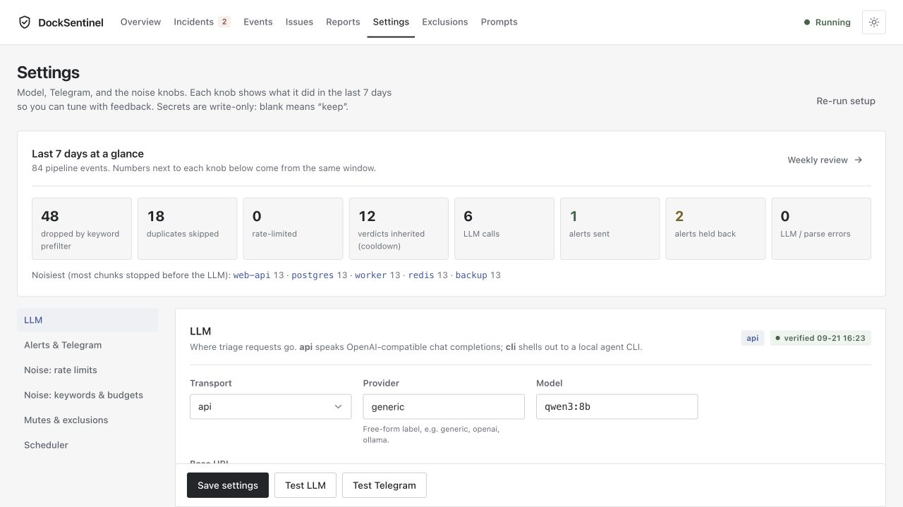
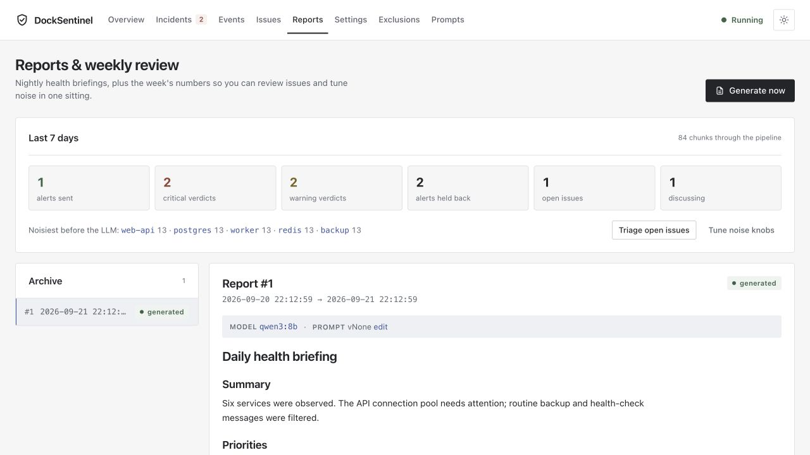
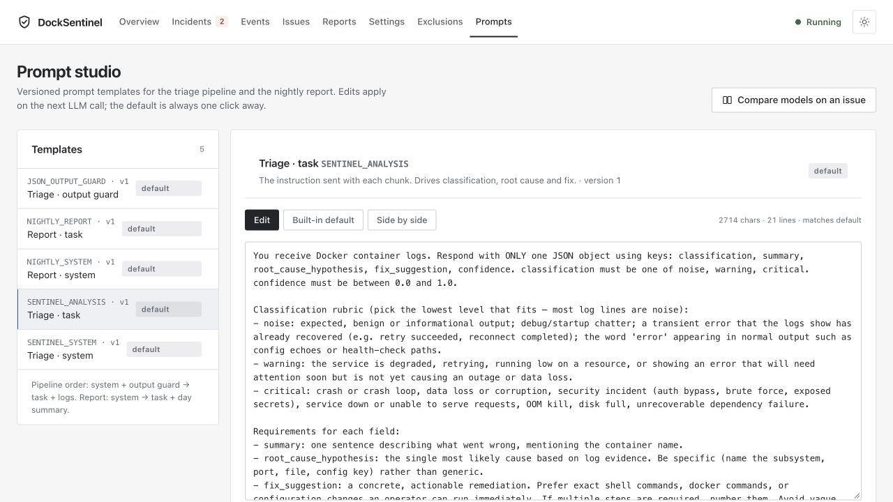
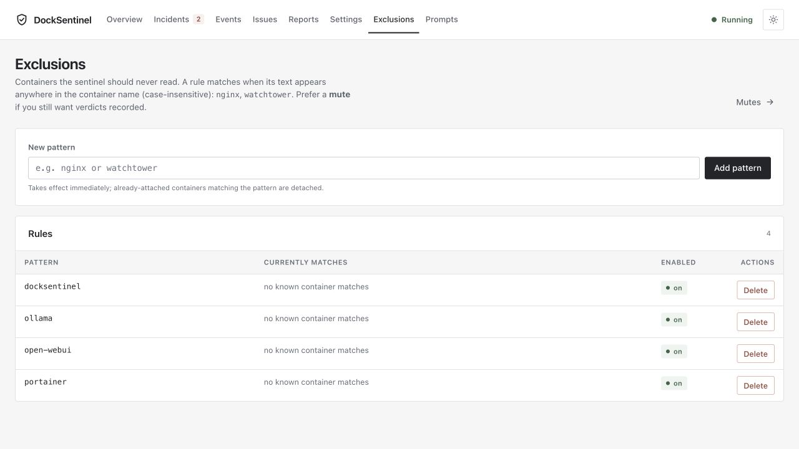

# DockSentinel

Self-hosted AIOps observability agent for Docker. It watches container logs in near real-time, routes keyword-matched chunks through an LLM for semantic triage, coalesces noise per-container, fires actionable Telegram alerts with an inline decision keyboard, and keeps a local issue tracker of every decision you make.



## Highlights

- **Actionable Telegram alerts** — every critical alert arrives with a concrete fix (exact `docker` / shell commands or config changes) and three inline buttons: `Reject`, `Approve`, `Discuss`.
- **Local issue tracker** — `Approve` creates an open issue. `Discuss` opens a threaded LLM conversation about the specific event. Query everything at `/issues` or via `GET /api/issues`.
- **Per-container sliding-window coalescing** — hold matched chunks for N seconds per container; every new chunk resets the timer; flush ships the whole batch in **one** LLM call. Turns crashloop spam into a single summary.
- **Dual LLM transports** — OpenAI-compatible API (Ollama, vLLM, OpenAI, OpenRouter, …) or pluggable CLI backends (`codex`, `claude`, `gemini`, `ollama`).
- **Self-discovery on the LAN** — publishes `<hostname>.local` via in-process mDNS (zeroconf). No avahi, no dbus, no webhook, no public URL.
- **Hardened container** — runs as non-root `appuser` (uid 1000), `HEALTHCHECK`, named volume, optional port-80 binding via `sysctls`.
- **Nightly health briefings** — APScheduler job generates a markdown report of the day's events, stored in SQLite and browsable at `/reports`.
- **Prompt Engineering Studio** — every prompt used by the pipeline is editable and versioned in SQLite. Test changes without redeploying.

## Screenshots

| | |
| --- | --- |
| **Overview** — sentinel state, today's counts, recent events, analyze-now | **Events** — searchable archive with root-cause & fix per event |
|  |  |
| **Issues** — local issue tracker populated by Telegram button taps | **Settings** — LLM, input budgets, alerts, scheduler |
|  |  |
| **Reports** — nightly briefings archive | **Prompts** — versioned prompt templates |
|  |  |
| **Exclusions** — container patterns to skip | |
|  | |

## How It Works

```
Docker events ─▶ DockerWatcher ─▶ per-container log stream
                                      │
                                      ▼
                           LogBuffer (char/token budget)
                                      │
                     ┌────────────────┴────────────────┐
                     ▼                                 ▼
              Prefilter (keyword                 (no match → drop)
              + word boundary, JSON
              false-positive guard)
                     │
                     ▼
              Dedup + per-container rate limit
                     │
                     ▼
          ChunkCoalescer (optional, per-container
          sliding window — batch chunks before LLM)
                     │
                     ▼
                LLM (API or CLI)
                     │
                     ▼
             VerdictParser (strict JSON)
                     │
            ┌────────┴────────┐
            ▼                 ▼
       Persist event    Alerter (if critical)
       to SQLite        │
                        ▼
                  Telegram message
                  + [Reject] [Approve] [Discuss]
                        │
                        ▼
                 TelegramBot (long-poll)
                        │
                        ▼
                LocalIssue (open / discussing / rejected)
```

## Requirements

- Python 3.12+
- Docker and Docker Compose
- For CLI-backend mode: the relevant CLI installed and authenticated on the host

## Quick Start (Docker Compose)

```bash
git clone https://github.com/rohanpandula/DockSentinel.git
cd DockSentinel
export SECRET_KEY=$(openssl rand -hex 32)
docker compose up -d --build
```

Open [http://localhost:5050](http://localhost:5050).

The default compose mounts `/var/run/docker.sock` read-only so DockSentinel can observe your containers, and exposes Flask on host port `5050`.

## Unraid / macvlan Deployment

See `docker-compose.unraid.example.yml` for a reference config. The container gets its own LAN IP on `br0`, binds port 80 via `sysctls`, and publishes itself as `<hostname>.local`. A minimal recipe:

```bash
# On the Unraid host:
mkdir -p /mnt/user/appdata/docksentinel
# …copy the repo and .env with SECRET_KEY into that path…
cd /mnt/user/appdata/docksentinel
docker compose -f docker-compose.unraid.yml up -d --build
```

Then open `http://docksentinel.local` from any Bonjour/Avahi-aware device on the LAN.

Gotchas:
- Adjust `group_add` to your host's `docker` group GID (Unraid's default is `281`; run `getent group docker` on another host to verify).
- Pick a free IP in your `br0` subnet for `networks.br0.ipv4_address`.
- Without macvlan, the vanilla `docker-compose.yml` works via host port mapping.

## Telegram Alerts + Inline Decisions

1. Create a bot with [@BotFather](https://t.me/BotFather), note its token and your chat id.
2. Open `Settings`, paste `telegram_token` and `telegram_chat_id`, and click **Test Telegram** to confirm delivery.
3. Enable the Sentinel from the Overview page.

When a critical event fires, your Telegram receives:

```
🚨 CRITICAL · <container>
━━━━━━━━━━━━━━━━
<one-sentence summary>

ROOT CAUSE
<specific hypothesis>

SUGGESTED FIX
1. <exact command>
2. <next step>

Confidence: 0.87
Event ID: 923

[✕ Reject] [✓ Approve] [💬 Discuss]
```

Tap behaviour:
- **Reject** — records a `rejected` `LocalIssue`, strips the keyboard, sends confirmation in-thread.
- **Approve** — records an `open` `LocalIssue` (title = summary, body = markdown with root cause + fix + excerpt) and replies with the issue number.
- **Discuss** — records a `discussing` `LocalIssue` and prompts you to reply. Your next reply (threaded to that prompt) is fed to the LLM with the full event context and answered in-thread. Keep replying to keep the conversation alive.

The bot uses long-polling (`getUpdates`) — **no webhook, no public URL, no tunnel required**. It works on a private LAN out of the box.

## Coalescing Noisy Containers

Set `chunk_coalesce_window_seconds` (Settings → *Alerts & rate limits* or `PUT /api/settings`) to hold matched log chunks per container in a sliding window. Every new matching chunk resets the timer; when the window elapses without new arrivals, the batch ships as a single LLM call and produces **one** summarized alert instead of dozens. `0` disables; `300` (five minutes) is a good starting value for a noisy homelab.

## CLI Backend Mode (no API keys)

1. In Settings, set `LLM Transport = cli` and pick a `CLI Backend` (`codex`, `claude`, `gemini`, `ollama`).
2. Click **Test LLM**.

Backend wrappers live in `llm-backends/` and follow a stdin/stdout contract: read one prompt from stdin, write the model response to stdout, exit non-zero on failure. Drop an executable `llm-backends/<name>.sh` in the mount to add a new backend.

## Environment Variables

| Variable | Default | Purpose |
|---|---|---|
| `SECRET_KEY` | *(required)* | Flask secret; must be ≥16 chars and not a placeholder |
| `DATABASE_URL` | `sqlite:///./data/docksentinel.db` | SQLite URI |
| `RUNTIME_LOCK_PATH` | `./data/runtime.lock` | File lock to prevent duplicate coordinators |
| `START_COORDINATOR` | `true` | Start the watchdog + scheduler + bot on boot |
| `DOCKER_HOST` | `unix:///var/run/docker.sock` | Docker daemon endpoint |
| `CLI_BACKENDS_DIR` | `/app/llm-backends` | Directory containing CLI backend scripts |
| `APP_PORT` | `5000` | Port Flask binds to inside the container |
| `MDNS_ENABLED` | `false` | Publish `<hostname>.local` via zeroconf |
| `MDNS_HOSTNAME` | `docksentinel` | Advertised hostname |
| `MDNS_PORT` | `80` | Port advertised in the mDNS service record (set it to `APP_PORT` if you change the port) |
| `BASIC_AUTH_USER` | *(unset)* | With `BASIC_AUTH_PASSWORD`, require HTTP basic auth on every route except `/api/health` |
| `BASIC_AUTH_PASSWORD` | *(unset)* | Password for basic auth (both vars must be set to enable) |
| `DOCKSENTINEL_CLI_ENV_PASSTHROUGH` | *(unset)* | Comma-separated extra env var names to pass to CLI backends. By default only `PATH`/`HOME`/locale/proxy vars and `OPENAI_*`, `ANTHROPIC_*`, `CLAUDE_*`, `CODEX_*`, `GEMINI_*`, `GOOGLE_*`, `OLLAMA_*` reach the CLI — never the app's own secrets |

## API Endpoints

```
GET    /api/health                      # {"status": "ok", "runtime": {"runtime_status": "running"|"degraded"|..., ...}}
GET    /api/settings                    # secrets masked as ********
PUT    /api/settings                    # partial update; blank/masked secret = keep, null = clear
POST   /api/settings/test-llm           # one-shot call using the SAVED settings (UI saves first)
POST   /api/telegram/test
GET    /api/ollama/models?base_url=     # list models on an Ollama host (http(s) only)

GET    /api/sentinel/status
POST   /api/sentinel/toggle
POST   /api/sentinel/analyze-now

GET    /api/insights                    # analysis events; ?container=&classification=&start=&end=&sort=&limit=&offset=
GET    /api/reports
GET    /api/reports/{id}
POST   /api/reports/generate

GET    /api/issues
GET    /api/issues/{id}
PATCH  /api/issues/{id}
POST   /api/issues/{id}/try-llm         # {"prompt": ..., "model"?, "base_url"?, "api_key"?, "transport"?, "cli_backend"?}
                                        # a base_url override never receives the stored api_key

GET    /api/exclusions
POST   /api/exclusions
DELETE /api/exclusions/{id}

GET    /api/prompts
PUT    /api/prompts/{key}
POST   /api/prompts/{key}/reset
```

Request/response bodies are validated by Pydantic v2 schemas (see `app/schemas/`). Paginated list endpoints accept `limit` and `offset`.

`GET /api/health` returns HTTP 200 with `status: "ok"` whenever the process is up (liveness); LLM/parse failures are reported in `runtime.runtime_status` (`degraded`) and `runtime.llm_failure_count`, not in the top-level `status`, so the Docker `HEALTHCHECK` only fails when the app is unreachable.

## Project Layout

```
app/
  api/            Flask blueprints — one per resource
  models/         SQLAlchemy ORM models (events, settings, prompts,
                  reports, exclusions, sentinel state, local issues)
  repositories/   Data access per aggregate
  schemas/        Pydantic v2 request/response schemas
  services/       Sentinel pipeline, alerts, telegram, telegram_bot,
                  chunk coalescer, briefing, LLM client, CLI backends,
                  prefilter, log buffer, mdns, coordinator
  templates/      Jinja2 HTML pages
  static/         CSS + JS + favicon
  web/            Server-rendered routes
llm-backends/     Pluggable CLI backend scripts (stdin → stdout)
migrations/       Alembic migrations (SQLite-safe via batch mode)
tests/            pytest suite (pytest suite, 80% coverage gate)
Dockerfile
docker-compose.yml            Default (local socket, host port 5050)
docker-compose.unraid.example.yml  Reference for macvlan / LAN IP deploys
docker-entrypoint.sh
requirements.txt
pytest.ini
alembic.ini
```

## Local Development

```bash
python3.12 -m venv .venv
source .venv/bin/activate
pip install -r requirements.txt
flask --app app run --debug
```

SQLite lives at `./data/docksentinel.db` by default. Alembic runs on container startup (`alembic upgrade head`); for local dev run it manually after dependency changes:

```bash
alembic upgrade head
```

## Testing

```bash
pytest -q                  # quick
pytest                     # with coverage report (gated at 80%)
pytest --cov-report=html   # browse htmlcov/index.html
```

The suite (137+ tests) covers:
- API endpoints (health, settings, sentinel, reports, issues, prompts, exclusions)
- Request/response schema parity and pagination
- Sentinel pipeline — critical path, cooldown dedup, chunk dedup, per-container rate limiting
- Prefilter word-boundary + JSON-benign filtering
- Log buffer keyword batching
- Briefing fallback
- Runtime lock health checks
- CLI backend runner
- LLM client
- Pipeline integration end-to-end

## Prompt Templates

Seeded on first startup and editable from `/prompts`:

- `SENTINEL_SYSTEM` — system role for triage
- `SENTINEL_ANALYSIS` — the JSON-output instruction (demands concrete fix commands)
- `JSON_OUTPUT_GUARD` — strict-JSON guard rail
- `NIGHTLY_SYSTEM` — system role for nightly briefings
- `NIGHTLY_REPORT` — briefing structure

Every prompt is versioned in SQLite; edits take effect on the next LLM call.

## LLM Call Reduction Layers

DockSentinel stacks multiple guards before spending an LLM token:

| Guard | Setting | Default | What it does |
|---|---|---|---|
| Word-boundary prefilter | `keyword_list` | `error,exception,fatal,panic,critical,refused,timeout` | Skips compound identifiers and JSON keys |
| Keyword flush delay | `keyword_flush_delay_lines` | `5` | Collects trailing context after a keyword hit |
| Chunk dedup (SHA-256) | `dedup_window_seconds` | `300` | Same chunk already analyzed recently? Skip |
| Per-container rate limit | `container_rate_limit_count` / `_window_seconds` | `10` / `3600` | Hard cap per container per rolling hour |
| Coalesce window | `chunk_coalesce_window_seconds` | `0` (off) | Batch per-container chunks, one LLM call per window |
| Alert cooldown | `alert_cooldown_minutes` | `10` | Suppress duplicate alerts by chunk hash |
| Alert rate limit | `alert_rate_limit_count` / `_window_seconds` | `20` / `300` | Global cap on notifications |

All configurable from Settings or `PUT /api/settings`.

## Default Exclusions

Seeded on first startup — patterns the Sentinel will not attach to:

- `docksentinel`
- `ollama`
- `portainer`
- `open-webui`

Edit the list at `/exclusions` or via the Exclusions API.

## Data Model

- `analysis_events` — every processed chunk (whether triaged, deduped, rate-limited, or coalesced)
- `daily_reports` — nightly briefing outputs
- `settings` — singleton config row (`id=1`)
- `sentinel_state` — runtime state (enabled, runtime_status, started_at, llm_failure_count, last_error)
- `exclusion_rules` — container name patterns to skip
- `prompt_templates` — versioned editable prompts
- `local_issues` — issues created from Telegram decisions (open / discussing / rejected / closed) with threaded discussion transcripts

## Tech Stack

Flask 3, SQLAlchemy 2, Alembic, Pydantic v2 (+ Flask-Pydantic), APScheduler, Docker SDK, httpx, tiktoken, zeroconf, pytest + pytest-cov. Python 3.12-slim base image, non-root runtime.

## License

No `LICENSE` file is currently committed. Until one is added, default copyright applies — all rights reserved. Add your preferred license before accepting external contributions.

## Security Notes

- **Set `BASIC_AUTH_USER` / `BASIC_AUTH_PASSWORD`** unless the app is only reachable from a trusted network. Without them anyone who can reach the port can change settings and read events.
- **Secrets are write-only.** `GET /api/settings` and the Settings page return `********` for `llm_api_key`/`telegram_token`; sending a blank or masked value on write keeps the stored secret.
- **Cross-site writes are rejected.** State-changing requests whose `Origin`/`Referer` host differs from the app's host get `403`, so a malicious web page can't drive the API from the operator's browser.
- **Telegram bot privacy:** for group chats, disable *privacy mode* in @BotFather or the bot won't receive your callbacks. 1:1 chats work out of the box.
- **Fail-closed defaults:** a misconfigured LLM or Telegram returns a clear error envelope and the health endpoint reports `runtime.runtime_status: degraded` — it does not silently swallow failures.
