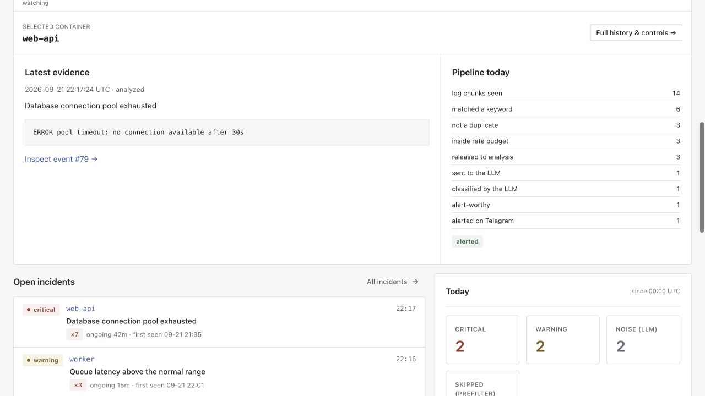
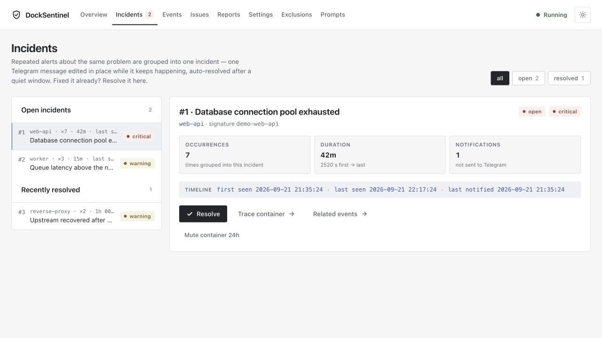
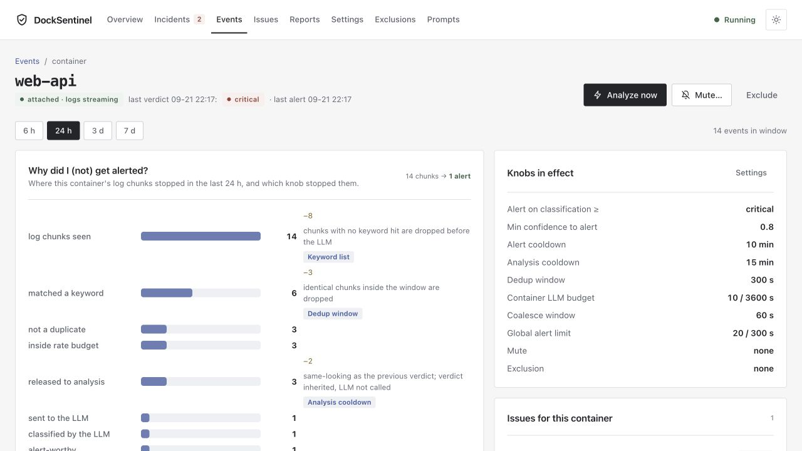

# DockSentinel

Self-hosted Docker monitoring with LLM-assisted log triage, Telegram alerts, and a dashboard that explains what was analyzed, skipped, or suppressed. DockSentinel groups recurring problems into incidents, keeps an issue history of operator decisions, and generates nightly health briefings.

It suggests fixes for you to review. Approving an issue or resolving an incident does **not** run remediation commands or restart containers.


[Quick start](#quick-start) · [Screenshots](#screenshots) · [Configuration](#configuration) · [Telegram](#telegram-alerts-and-decisions) · [Tuning](#noise-reduction-and-alert-policy) · [Unraid](#unraid-and-lan-discovery) · [API](#api-reference) · [Development](#local-development)

## What it does

- **Log triage:** watches Docker container logs, filters likely problems, and asks an OpenAI-compatible API or CLI backend for a classification, root-cause hypothesis, fix suggestion, and confidence score.
- **Operational dashboard:** runtime status, setup checklist, open incidents, delivery failures, today's pipeline counts, and a compact container table with running-container inventory and recorded activity. Select a row to inspect its evidence and pipeline counts.
- **Event investigation:** filter by container, classification, time, pipeline status, and delivery outcome; inspect log excerpts, model details, errors, and suppression reasons. Container pages show the pipeline funnel and recent history.
- **Incident tracking:** folds matching alert-worthy recurrences into an existing Telegram message, with escalation, optional reminders, manual resolution, and quiet-period auto-resolution.
- **Operator decisions:** approve, reject, or discuss an alert in Telegram; manage the resulting local issues and try another model against the same issue context in the dashboard.
- **Noise control:** keyword filtering, exact chunk deduplication, similar-verdict reuse, per-container limits, bounded batching, notification cooldowns, mutes, and exclusions.
- **Lifecycle signals:** records container exits, OOMs, restarts, and unhealthy transitions; detects exit/OOM storms without an LLM call.
- **Briefings and prompts:** scheduled reports with Telegram delivery, on-demand reports, and editable prompt templates with version counters and reset-to-default controls.

The application uses Flask/Jinja2, SQLite, SQLAlchemy, Alembic, Pydantic, APScheduler, and the Docker SDK. The image runs Python 3.12 as a non-root user. No separate database or frontend build is required.

## Quick start

You need a running Docker daemon and Docker Compose. An LLM endpoint or an installed, authenticated CLI backend is needed for semantic analysis; Telegram is optional for browsing events but required for phone alerts and bot decisions.

```bash
git clone https://github.com/rohanpandula/DockSentinel.git
cd DockSentinel
# Run once to create a persistent secret. Preserve an existing .env on upgrades.
printf 'SECRET_KEY=%s\n' "$(openssl rand -hex 32)" > .env
docker compose up -d --build
```

Open [http://localhost:5050](http://localhost:5050), then:

1. Open **Settings**, configure the LLM URL and model, save, and run **Test LLM**. Defaults target Ollama at `http://host.docker.internal:11434/v1`, model `llama3`; that model must already exist on your server. Choose an installed model or use the Ollama model picker.
2. Configure and test Telegram if you want notifications (see [setup](#telegram-alerts-and-decisions)).
3. Start the Sentinel from **Overview**. It is disabled on a new database; starting the container alone does not enable monitoring.
4. Use **Analyze now** on a container, then inspect **Events** for the verdict or a reason it was skipped.

`Analyze now` reads the last 200 log lines and bypasses keyword filtering, batching, and similar-verdict reuse. Exclusions, exact-chunk deduplication, and per-container rate limits still apply.

The default Compose file exposes host port **5050**, stores state in the `docksentinel_data` named volume, and mounts `/var/run/docker.sock`. On Linux, the app's UID 1000 may need the socket's group added; see [troubleshooting](#troubleshooting). API endpoints hosted on the Docker host must listen on an address reachable from the container; `localhost` inside DockSentinel means DockSentinel itself.

### Require a dashboard login

Basic authentication is optional and disabled by default. To enable it with the default Compose deployment, add credentials to `.env` and create `compose.override.yaml`:

```dotenv
BASIC_AUTH_USER=admin
BASIC_AUTH_PASSWORD=replace-with-a-long-unique-password
```

```yaml
services:
  docksentinel:
    environment:
      BASIC_AUTH_USER: ${BASIC_AUTH_USER:?Set BASIC_AUTH_USER}
      BASIC_AUTH_PASSWORD: ${BASIC_AUTH_PASSWORD:?Set BASIC_AUTH_PASSWORD}
```

Then run `docker compose up -d`. Both variables must reach the **container environment**; adding them only to `.env` does not enable authentication because the base Compose file does not forward them. `/api/health` remains unauthenticated for health checks. Use HTTPS through a trusted reverse proxy when sending credentials across an untrusted network.

## Screenshots

Captured **September 21, 2026** from the current application using **synthetic demonstration data**, not private production logs or credentials. The overview above and the gallery below show the actual server-rendered interface.

<details>
<summary>Selected container: evidence and pipeline</summary>



</details>

| Monitor | Investigate |
| --- | --- |
| **Incidents** — recurring problems, counts, timeline, and resolution | **Events** — verdicts, pipeline outcomes, and log context |
|  |  |
| **Container** — pipeline funnel, recent activity, and mute controls | **Issues** — decisions, suggested fixes, and model experiments |
|  |  |
| **Settings** — providers, notifications, input budgets, and tuning | **Reports** — briefing archive and weekly activity summary |
|  |  |
| **Prompts** — edit and reset pipeline templates | **Exclusions** — container patterns and matching names |
|  |  |

## How monitoring works

```text
Docker logs → bounded log buffer → keyword prefilter
            → exact-chunk dedup → per-container rate limit
            → optional bounded batch → similar-verdict reuse
            → LLM call → JSON verdict → stored event
                                    → alert policy → incident → Telegram

Docker lifecycle events → stored event → exit/OOM storm detection → alert policy
Telegram decisions      → local issue + optional threaded LLM discussion
Scheduled briefing      → saved report + Telegram delivery when configured
```

An event can be analyzed, skipped, deduplicated, rate-limited, queued for batching, excluded, or marked with an LLM/parse error. A stored event is not necessarily a completed LLM analysis, and an analyzed event is not necessarily a delivered notification. The dashboard separates these outcomes.

The **Events** screen lives at `/insights`; container details at `/containers/<name>`. Other screens are `/dashboard`, `/incidents`, `/issues`, `/settings`, `/reports`, `/prompts`, and `/exclusions`.

## Configuration

Most runtime settings live in SQLite and are editable in **Settings** or with `PUT /api/settings`. Environment variables configure process startup and deployment. Existing databases retain saved settings across upgrades.

### LLM backends

**API transport** calls an OpenAI-compatible endpoint. Set the base URL, model, and API key appropriate for your provider. Local Ollama uses the `/v1` endpoint; remote providers receive the log excerpts and context sent for analysis. `llm_extra_request_json` accepts an object of additional request parameters for provider-specific options.

**CLI transport** invokes a wrapper in [`llm-backends/`](llm-backends/). Select `cli` and a backend in Settings, then test it:

| Backend | Wrapper | Image availability |
| --- | --- | --- |
| Codex | `codex.sh` | CLI installed; supply authentication/configuration for `appuser` |
| Gemini | `gemini.sh` | CLI installed; supply authentication/configuration for `appuser` |
| Claude | `claude.sh` | Wrapper included; install the CLI separately |
| Ollama | `ollama.sh` | Wrapper included; install the CLI separately; model comes from `OLLAMA_MODEL` (default `llama3`) |

A CLI installed or logged in on the host is **not automatically available inside the container**. Install missing executables in a custom image and explicitly supply the needed credentials or configuration. The image's user home is `/home/appuser`.

Custom backends use an executable `<name>.sh`: read one prompt from stdin, write the response to stdout, and exit nonzero on failure. Configure `CLI_BACKENDS_DIR` to use another directory. Calls are serialized, have timeouts and retries, and receive a filtered environment. Treat CLI backend access as sensitive: wrappers differ in their tool restrictions.

### Defaults that affect daily operation

| Setting | New-database default |
| --- | --- |
| API URL / model / key | `http://host.docker.internal:11434/v1` / `llama3` / `ollama` |
| API timeout / retries | `20` seconds / `2` retries |
| CLI backend / timeout / retries | `codex` / `120` seconds / `1` retry |
| Input character / token budgets | `16000` / `4000` |
| Reserved output tokens | `600` |
| Token estimation strategy | `chars` |
| Nightly report time | `00:05` in the scheduler's local timezone |
| Event retention | `14` days; daily cleanup at `03:15` in the scheduler's local timezone |
| Alert threshold | `critical` |
| Confidence floor | `0.0` (disabled) |

The stock container normally uses UTC; verify its timezone when configuring the schedule. Briefings summarize a rolling 24-hour window. If generation fails, a fallback report is saved with the error recorded. The Reports screen also summarizes seven days of activity.

### Environment variables

| Variable | Default / meaning |
| --- | --- |
| `FLASK_ENV` | `development` in code; Compose sets `production` |
| `SECRET_KEY` | Required in production: at least 16 characters, not a placeholder |
| `DATABASE_URL` | Development: `sqlite:///./data/docksentinel.db`; production/Compose: `sqlite:////data/docksentinel.db`. Use an absolute SQLite URL for local development to keep Flask and Alembic on the same file. |
| `RUNTIME_LOCK_PATH` | Development: `./data/runtime.lock`; production/Compose: `/data/runtime.lock` |
| `START_COORDINATOR` | `true`; starts the coordinator, scheduler, and bot, subject to the runtime lock |
| `DOCKER_HOST` | Compose: `unix:///var/run/docker.sock` |
| `CLI_BACKENDS_DIR` | `/app/llm-backends`; set it to the checkout's directory when running locally |
| `APP_PORT` | `5000` for the Docker entrypoint; default host mapping is `5050:5000` |
| `MDNS_ENABLED` | `false`; set `true` to publish the LAN service |
| `MDNS_HOSTNAME` / `MDNS_PORT` | `docksentinel` / `80`; match the advertised port to your deployment |
| `BASIC_AUTH_USER` / `BASIC_AUTH_PASSWORD` | Unset; both must be set to require login |
| `DOCKSENTINEL_CLI_ENV_PASSTHROUGH` | Optional comma-separated environment names to additionally expose to CLI processes |

The CLI environment includes common path, locale, proxy, certificate, and provider configuration variables. App credentials such as `SECRET_KEY`, `DATABASE_URL`, and `BASIC_AUTH_*` are omitted by default. See [`app/services/cli_backends.py`](app/services/cli_backends.py) for the exact allowlist. Any extra deployment variable must be forwarded through Compose or your container configuration explicitly.

## Telegram alerts and decisions

1. Create a bot with [BotFather](https://t.me/BotFather).
2. Save its token in Settings, send `/start` to the bot, and use **Detect chat** to discover your chat ID, or enter the ID yourself.
3. Save the chat ID and click **Test Telegram**.

The bot uses outbound long polling; no webhook, public URL, or tunnel is required. It still needs access to Telegram. Operator actions are checked against the configured chat. Run one poller for a bot token.

An analysis alert includes its classification, container, summary, root-cause hypothesis, suggested fix, confidence, and event ID. Available actions include:

| Action | Result |
| --- | --- |
| **Approve** | Creates an `open` local issue containing the suggested fix and event context |
| **Reject** | Records a `rejected` issue; suppresses further analysis alerts for that container for 24 hours |
| **Discuss** | Creates a `discussing` issue and starts an LLM conversation; reply to the bot's discussion messages to continue |
| **Mute** | Suppresses container alerts for the offered duration while retaining monitoring and event history |
| **Resolve** | Marks the associated incident resolved |

Issues can also be closed or reopened in the dashboard. They are local database records, not GitHub issues. Suggested shell commands remain suggestions for the operator to inspect and execute separately.

Commands supported in the operator chat:

```text
/incidents             List up to 10 open incidents
/resolve <id>          Resolve an incident
/mutes                 List active container mutes
/unmute <container>    Remove a container mute
```

## Incidents

An incident groups alert-worthy occurrences by container, severity, and a normalized problem summary. Normalization removes changing details such as timestamps and numeric identifiers. Severity escalation can upgrade an existing incident and send a fresh notification; otherwise repeated occurrences update its existing Telegram message. Optional reminders are checked when another matching occurrence arrives.

Incident grouping happens **after alert gates**. Occurrences blocked by cooldowns, mutes, or other gates do not necessarily increment the incident count. Counts represent occurrences reaching that layer, not every matching log line.

| Setting | Default | Behavior |
| --- | --- | --- |
| `incident_resolve_after_minutes` | `30` | Auto-resolve after this quiet period since the last recorded occurrence |
| `incident_reminder_hours` | `0` | Matching recurrences can send a reminder after this interval; `0` disables reminders |
| `incident_notify_on_resolve` | `true` | Send a closing notification on automatic resolution |

A background job checks for quiet incidents every five minutes. Resolution means the incident record was closed; it is not proof that a service recovered or that a fix ran. You can also resolve from the dashboard, Telegram, or API.

## Noise reduction and alert policy

The Settings screen includes recent pipeline impact and noisy-container summaries to help tune these controls.

| Control | Setting and default | Effect |
| --- | --- | --- |
| Keyword context | `keyword_flush_delay_lines=5` | Collects trailing lines after a keyword match |
| Exact chunk deduplication | `dedup_window_seconds=300` | Avoids reanalyzing recently analyzed identical content |
| Per-container limit | `container_rate_limit_count=10`, `container_rate_limit_window_seconds=3600` | Limits recent analysis calls per container |
| Batching | `chunk_coalesce_window_seconds=0` | Disabled by default; one batch per container flushes after the configured age |
| Similar-verdict reuse | `analysis_cooldown_minutes=15` | Reuses a recent warning/noise verdict for similar content; does not reuse a critical verdict |
| Severity threshold | `alert_min_classification=critical` | Direct notification threshold; can include warnings |
| Confidence floor | `alert_min_confidence=0.0` | Suppresses verdicts below the configured confidence when enabled |
| Notification cooldown | `alert_cooldown_minutes=10` | Suppresses recent alerts for the same container ID and classification, not just identical log text |
| Global notification limit | `alert_rate_limit_count=20`, `alert_rate_limit_window_seconds=300` | Caps recent event alerts |
| Persistent warnings | `persistent_warning_count=3`, `persistent_warning_window_minutes=60` | Escalates repeated warnings; includes reused warning verdicts and avoids repeating the same episode's alert |
| Exit/OOM storms | `restart_alert_count=3`, `restart_alert_window_minutes=10` | Alerts when die/OOM events reach the threshold; does not require an LLM |

Default keywords:

```text
error,exception,fatal,panic,critical,refused,timeout,traceback,failed,denied,
killed,oom,unhealthy,segfault,out of memory
```

The prefilter uses word boundaries and guards against benign JSON values. Tune keywords for your workloads instead of assuming every error-like string is actionable.

**Batching uses a maximum age, not a sliding debounce.** With a window of `300`, the first chunk starts a five-minute timer. Later chunks join the batch without resetting it, so a continuously noisy container still gets analyzed. Combined input is bounded by the character budget and remains subject to downstream checks.

**Mutes and exclusions serve different purposes.** Mutes suppress alerts while retaining analysis; exclusions stop the watcher attaching to matching containers and prevent manual analysis. Exclusion patterns are case-insensitive substrings, not regular expressions or glob patterns. Startup seeds missing defaults: `docksentinel`, `ollama`, `portainer`, and `open-webui`; deleting one of these defaults can cause it to return on restart.

## Unraid and LAN discovery

Use [`docker-compose.unraid.example.yml`](docker-compose.unraid.example.yml) when the container should have its own LAN IP on Unraid's external `br0` Docker network:

```bash
cd /mnt/user/appdata
git clone https://github.com/rohanpandula/DockSentinel.git docksentinel
cd docksentinel
cp docker-compose.unraid.example.yml docker-compose.unraid.yml
printf 'SECRET_KEY=%s\n' "$(openssl rand -hex 32)" > .env
# Edit docker-compose.unraid.yml before starting.
docker compose -f docker-compose.unraid.yml up -d --build
```

For an existing deployment, preserve its checkout, `.env`, Compose file, and data volume rather than recreating them. In the example configuration, replace `10.0.0.X` with an unused IP in your `br0` subnet and verify the Docker socket group ID (`group_add`, example `281`). The external network must already exist.

The example binds port 80 as the non-root user using a sysctl, enables mDNS, and advertises `docksentinel.local`. Open `http://<chosen-ip>` or [http://docksentinel.local](http://docksentinel.local) on a LAN that supports mDNS. Discovery depends on local network multicast behavior; the IP remains the direct access path. The ordinary Compose deployment works on Unraid too, using its host port mapping.

For authentication with this custom filename, add the same environment entries directly to `docker-compose.unraid.yml` or explicitly include an override with a second `-f`; the default override is not automatically applied to an explicit `-f` deployment.

## Updating and backing up

Keep the database, `.env`, deployment overrides, and any CLI credentials/configuration backed up. Settings, API keys, Telegram tokens, prompt edits, issues, incidents, mutes, events, and reports are stored in SQLite. Secret masking in the UI does not encrypt them at rest.

For a simple consistent backup of the default deployment, stop the app before copying `/data`:

```bash
umask 077
backup_dir="../docksentinel-backups/$(date +%Y%m%d-%H%M%S)"
mkdir -p "$backup_dir"
docker compose stop docksentinel
docker cp docksentinel:/data "$backup_dir/data"
cp .env "$backup_dir/.env"
# Also copy any Compose overrides and separately managed CLI configuration.
docker compose start docksentinel
```

Store the backup privately and outside the repository. For Unraid, use the deployment's `-f docker-compose.unraid.yml` on Compose commands. Check every backup command succeeded before proceeding with an upgrade.

Then update a clean deployment checkout:

```bash
git status --short
git pull --ff-only origin main
docker compose up -d --build
docker compose logs --tail=100 docksentinel
curl -fsS http://localhost:5050/api/health
```

The entrypoint runs `alembic upgrade head` before starting Flask and handles known legacy pre-Alembic schemas. Migrations change persistent state: if rolling back, restore a compatible database backup along with the earlier application version. Do not use `docker compose down -v` unless you intend to delete the named data volume.

Event retention removes old analysis-event rows, including lifecycle history, rather than all database records. Retention is not a substitute for a backup.

## API reference

Requests and responses use JSON. Authenticate with HTTP Basic auth when enabled. Insights and reports support `limit` and `offset`; other collection responses and query parameters differ as listed below. Pydantic schemas for validated endpoints live in [`app/schemas/`](app/schemas/).

| Method | Endpoint | Purpose / parameters |
| --- | --- | --- |
| GET | `/api/health` | Process liveness plus runtime state |
| GET | `/api/settings` | Settings; API key and Telegram token masked |
| PUT | `/api/settings` | Partial update; blank/masked secrets preserve values, `null` clears supported secret fields |
| POST | `/api/settings/test-llm` | Tests **saved** LLM settings |
| POST | `/api/telegram/test` | Sends a test message using saved credentials |
| GET | `/api/telegram/detect-chat` | Last chat seen by the bot, for setup |
| GET | `/api/ollama/models` | Model discovery; optional `base_url` |
| GET | `/api/sentinel/status` | Sentinel state and attached container IDs |
| POST | `/api/sentinel/toggle` | `{"enabled": true}` or `false`; omitted value toggles |
| POST | `/api/sentinel/analyze-now` | `{"container": "name-or-id"}` |
| GET | `/api/insights` | `container`, `classification`, `start`, `end`, `sort`, `limit`, `offset`; returns `{items, offset, limit}` |
| GET | `/api/reports` | `limit`, `offset`; returns `{items, offset, limit}` |
| GET | `/api/reports/{id}` | Report detail |
| POST | `/api/reports/generate` | Generate and save a report |
| GET | `/api/issues` | `status`, `limit`; returns an array |
| GET | `/api/issues/{id}` | Issue detail and discussion history |
| PATCH | `/api/issues/{id}` | Set `status`: `open`, `discussing`, `rejected`, or `closed` |
| POST | `/api/issues/{id}/try-llm` | Required `prompt`; optional `model`, `base_url`, `api_key`, `transport`, `provider`, `cli_backend` |
| GET | `/api/incidents` | `status=open\|resolved`, `limit=1..500`; returns `{items}` |
| GET | `/api/incidents/{id}` | Incident detail |
| POST | `/api/incidents/{id}/resolve` | Resolve; `404` if missing, `409` if already resolved |
| GET | `/api/exclusions` | List rules |
| POST | `/api/exclusions` | Add a `container_pattern` rule |
| DELETE | `/api/exclusions/{id}` | Delete a rule |
| GET | `/api/mutes` | Active mutes |
| PUT | `/api/mutes/{container_name}` | `{"hours": 24, "reason": "maintenance"}`; `hours` is `1..8760`, or `null`/omitted for indefinite |
| DELETE | `/api/mutes/{container_name}` | Unmute |
| GET | `/api/prompts` | List templates |
| PUT | `/api/prompts/{key}` | Update template `content` |
| POST | `/api/prompts/{key}/reset` | Restore shipped default |

Dates use ISO 8601; insights sort accepts `created_at` or `-created_at`. The Events page's status/delivery filters are UI filters, not additional `/api/insights` parameters. An issue experiment targeting a different `base_url` does not receive the stored API key unless a key is supplied in that request.

`GET /api/health` returns HTTP 200 with `status: "ok"` when the app can serve the request. Inspect `runtime.runtime_status`, `runtime.llm_failure_count`, and runtime errors for operational health. A healthy Docker container is not proof of successful LLM analysis or Telegram delivery.

## Local development

Use Python 3.12, the same version as the image and CI. Set an **absolute** database URL so Alembic and Flask-SQLAlchemy resolve the same file:

```bash
python3.12 -m venv .venv
source .venv/bin/activate
pip install -r requirements.txt
mkdir -p data
export FLASK_ENV=development
export SECRET_KEY="$(openssl rand -hex 32)"
export DATABASE_URL="sqlite:///$(pwd)/data/docksentinel.db"
export RUNTIME_LOCK_PATH="$(pwd)/data/runtime.lock"
export CLI_BACKENDS_DIR="$(pwd)/llm-backends"
export START_COORDINATOR=false
alembic upgrade head
flask --app app run --debug --port 5050
```

This starts a UI/API development session without background Docker monitoring, scheduled jobs, or Telegram polling. To exercise the full runtime, provide Docker access and credentials, set `START_COORDINATOR=true`, and run without the debug reloader:

```bash
START_COORDINATOR=true flask --app app run --port 5050
```

Run `alembic upgrade head` after pulling new migrations. Outside testing, the application does not create tables automatically. The runtime file lock prevents duplicate coordinators; use one background coordinator per database/deployment.

### Tests

```bash
TESTING=true START_COORDINATOR=false python -m pytest -q
```

Pytest always runs with coverage via [`pytest.ini`](pytest.ini), including with `-q`. The gate is **80%**, and an HTML report is written to `htmlcov/index.html`. The September 21, 2026 verification completed **230 tests with 88.94% coverage**.

The suite covers APIs, validation, templates, alert policy, incidents, coalescing, Telegram decisions, reports, CLI execution, request security, migrations, and pipeline integration. CI runs the suite on pushes and pull requests using Python 3.12. Tests do not establish live connectivity to your configured LLM or Telegram account; use the Settings tests for those integrations.

### Project layout

```text
app/
  api/            JSON resource endpoints
  models/         SQLAlchemy models
  repositories/   Persistence and query helpers
  schemas/        Pydantic request/response models
  services/       Docker watcher, triage, LLMs, alerts, incidents, bot, scheduler
  templates/      Jinja2 dashboard pages
  static/         CSS, JavaScript, favicon
  web/            Page routes and presentation helpers
llm-backends/     Executable stdin/stdout CLI wrappers
migrations/      Alembic schema migrations
tests/           Pytest suite
docs/screenshots/ README images
```

Prompt keys are `SENTINEL_SYSTEM`, `SENTINEL_ANALYSIS`, `JSON_OUTPUT_GUARD`, `NIGHTLY_SYSTEM`, and `NIGHTLY_REPORT`. Editing a template increments its version counter and affects subsequent calls; this is not a browsable archive of previous template text. Startup refreshes shipped defaults while preserving customized active content.

## Troubleshooting

| Symptom | Check |
| --- | --- |
| Container is healthy but nothing is monitored | Enable Sentinel; inspect `/api/sentinel/status`, exclusions, and runtime errors. The fleet combines running container names, today's recorded activity, and open incidents. Attachment is unknown when no recorded container ID is available. |
| Docker socket permission denied | Inspect `ls -ln /var/run/docker.sock` on the host; add its numeric group ID under the service's `group_add` and recreate the container. |
| LLM test fails | Verify the URL is reachable from the container, the model is installed, and provider credentials/options are correct. For CLI mode, check the executable and authentication inside the container. |
| An event did not alert | Inspect its pipeline status and delivery explanation; check severity/confidence, cooldowns, mutes, rejected issues, rate limits, and incident updates. |
| Telegram detection sees no chat | Save the token first, send `/start`, and ensure the coordinator/poller is running and no other process is consuming the same bot's updates. |
| `docksentinel.local` does not resolve | Use the assigned IP; verify mDNS is enabled and multicast can cross the relevant LAN segment. |
| Basic auth is not active | Verify **both** variables are passed into the container, not just defined in the host `.env`; recreate after changing them. |
| Database tables are missing locally | Check the absolute `DATABASE_URL` and run `alembic upgrade head` with that same environment. |
| Writes return 403 behind a proxy | Check the forwarded host and browser Origin/Referer. Configure the trusted proxy to set forwarding headers consistently. |

## Security and data boundaries

- The dashboard can read logs, change configuration, trigger LLM requests, and send notifications. Restrict access and enable authentication before exposing it beyond a trusted network. The bundled entrypoint uses Flask's server; public-facing production serving needs an appropriate deployment/proxy setup.
- The Docker socket is privileged. Mounting it with `:ro` does **not** make the Docker API read-only; a process that can access the socket may control the daemon.
- Logs can contain credentials and untrusted text. Selected excerpts are stored in SQLite and sent to the configured model; alert/report content is sent to Telegram. Choose providers and retention accordingly.
- API keys and bot tokens are masked in settings responses but stored in the database. Protect database backups, `.env`, and CLI authentication files.
- State-changing browser requests with mismatched Origin/Referer hosts are rejected. This is an additional request check, not a substitute for authentication or a trusted reverse proxy; requests without those headers can still be accepted.

## Maintainer and contributions

Maintained by [Rohan Pandula](https://github.com/rohanpandula). Report bugs and propose changes through [GitHub issues](https://github.com/rohanpandula/DockSentinel/issues) or pull requests. Include the behavior, relevant redacted logs, and a focused validation result. Do not include credentials, production database files, or private container logs.

Contributor credit and commit authorship are for human contributors. Do not add AI tools as contributors or append AI `Co-authored-by` trailers to future commits.

## License

No `LICENSE` file is currently committed. The repository does not currently grant an open-source license.
